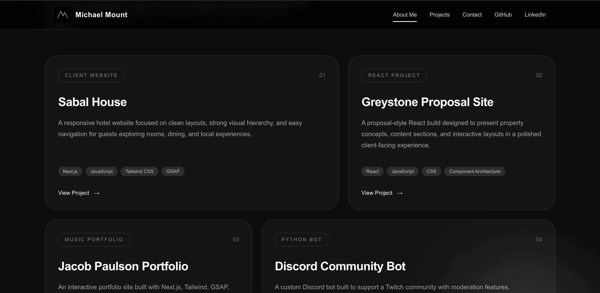
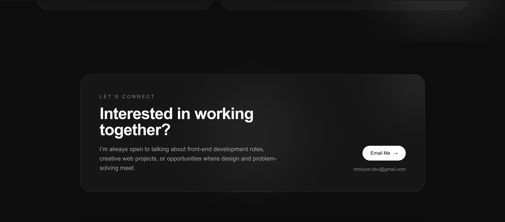

# Michael Mount Portfolio

A modern, responsive portfolio website built to showcase my web development projects, provide quick access to my work, and give visitors an easy way to contact me.

## Overview

**Michael Mount Portfolio** is a personal portfolio website designed to highlight selected projects, technical skills, and professional work as a frontend/web developer.

The site focuses on a clean user experience, responsive layouts, smooth animation, and easy navigation so recruiters, employers, clients, and collaborators can quickly explore my work.

## Features

- Responsive design for desktop, tablet, and mobile
- Project showcase with links to completed work
- Contact section for easy communication
- Smooth animations powered by GSAP
- Clean, modern UI built with Tailwind CSS
- Mobile-friendly layout and navigation

## Tech Stack

- **Next.js** – React framework for building the application
- **Tailwind CSS** – Utility-first CSS framework for styling
- **GSAP** – Animation library for smooth frontend interactions

## Installation

To run this project locally, clone the repository and install dependencies:

```bash
npm install
```

Start the development server:

```bash
npm run dev
```

Then open the project in your browser:

```bash
http://localhost:3000
```

## Project Goals

The goal of this portfolio was to create a professional online presence that clearly presents my work, skills, and contact information.

The project was built with a focus on:

- Clean visual presentation
- Easy project discovery
- Strong mobile responsiveness
- Smooth animated interactions
- Simple navigation for recruiters and visitors
- A polished frontend experience

## Screenshots

### Portfolio Section



### Contact Section



## What I Learned

While building this portfolio, I continued improving my ability to structure responsive Next.js layouts, use Tailwind CSS efficiently, and add polished animation with GSAP. I also focused on creating a user-friendly experience that presents projects clearly and professionally.

## Future Improvements

- Add more detailed case studies for each project
- Add filtering by project type or technology
- Improve project data management with a CMS or structured data file
- Add more animation polish and page transitions
- Continue updating the portfolio with new work

## Author

Built by **Michael Mount**
